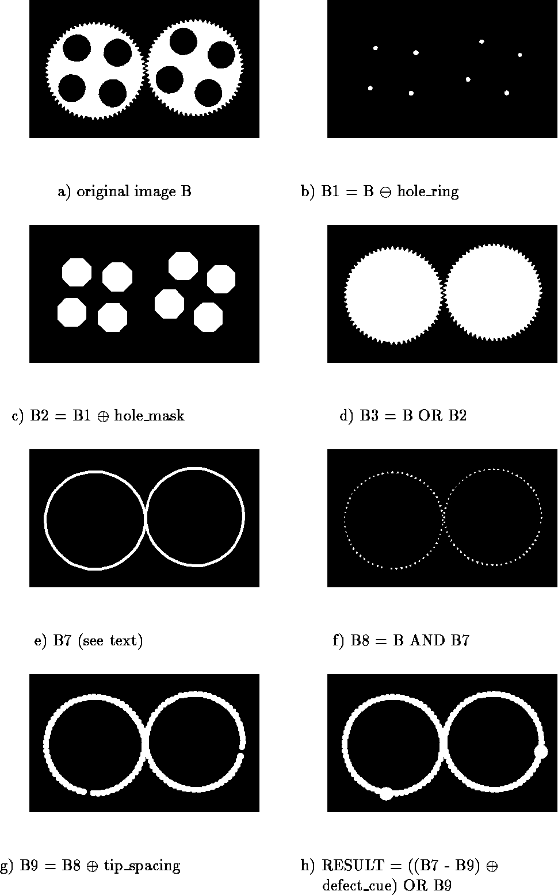

# Using-Morphological-Filter-to-detect-missing-teeth-from-gears

For detailed explanation, please check out `main.ipynb`.

## Some simple processes you may want to follow step by step

1. Input image from gear_tooth.png.
2. The objective is to detect missing teeth using a sequence of morphological filters.
3. Design a set of structure elements: **gear_body, sampling_ring_spacer, sampling_ring_width, tip_spacing, defect_cue**.
4. Apply morphological filters using the structure elements to generate the figures (e), (f), (g), (h).

    (e) Opening it with structure element **gear_body** to get rid of the teeth, dilating that with structure element **sampling_ring_spacer** to bring it out to the base of the teeth, dilating that with the structure element **sampling_ring_width** to bring the next image out to the tip of the teeth, and subtracting the last two results to get a ring that just fits over the teeth.

    (f) AND it with the original image to produce an image of just the teeth.

    (g) Dilating the teeth image with the structure element **tip_spacing** produces the solid ring image which has spaces in the solid ring wherever there are defects in the teeth.

    (h) Subtracting it from the sampling ring leaves only the defects, which are dilated by structure element **defect_cue**.

5. Show the output images.

## Example figures

